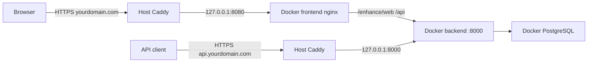

# Production Deployment Runbook (.cursor)

## Hedef

Mevcut [docker-compose.yml](docker-compose.yml) stack'ini (PostgreSQL + FastAPI backend + nginx frontend) kiralık bir Linux VPS'e taşıyıp HTTPS ile dış dünyaya açmak. Repoda **yeni dosya eklenmeyecek**; tek deliverable: `.cursor/production-deployment.plan.md` runbook'u.

## Mevcut mimari (referans)



Bugünkü compose yapısı:
- [docker-compose.yml](docker-compose.yml): `db`, `backend` (`8000:8000`), `frontend` (`8080:80`)
- Backend startup: [backend/docker-entrypoint.sh](backend/docker-entrypoint.sh) — DB oluşturma + Alembic + uvicorn
- Frontend proxy: [frontend/app/nginx.conf](frontend/app/nginx.conf) — `/api/` ve `/enhance/` backend'e gider
- Env şablonu: [.env.example](.env.example)

## Runbook içeriği (yazılacak bölümler)

### 1. Sunucu gereksinimleri
- Minimum: **2 vCPU, 2–4 GB RAM, 20 GB disk**
- OS: Ubuntu 22.04/24.04 LTS
- Gerekçe: PyTorch CPU inference (~225 MB backend RAM idle+model), PostgreSQL volume, Docker overhead

### 2. Ön hazırlık checklist
- Domain satın al ve DNS **A kaydı** → sunucu public IP (`@`, `www`, **`api`** subdomain)
- SSH erişimi (key-based auth önerisi)
- Git repo URL'si ve deploy branch'i

### 3. Sunucu ilk kurulum komutları
Runbook'ta kopyala-yapıştır blokları:
```bash
apt update && apt upgrade -y
apt install -y git curl ufw
curl -fsSL https://get.docker.com | sh
ufw allow OpenSSH && ufw allow 80/tcp && ufw allow 443/tcp && ufw enable
```

### 4. Uygulama deploy adımları
```bash
git clone <repo-url> && cd SoundMufflerRNN
cp .env.example .env
# .env düzenle (aşağıdaki production değerleri)
docker compose up --build -d
docker compose ps
curl http://127.0.0.1:8080/api/health
```

**Production `.env` değerleri** (runbook'ta tablo):
| Değişken | Production değeri |
|----------|-------------------|
| `POSTGRES_PASSWORD` | `openssl rand -hex 32` ile üret |
| `JWT_SECRET` | `openssl rand -hex 32` ile üret |
| `CORS_ORIGINS` | `https://yourdomain.com,https://www.yourdomain.com` |
| `ENHANCE_WEB_RATE_LIMIT` | `30` (demo, IP başına/dk) |
| `ENHANCE_API_RATE_LIMIT` | `120` (API key başına/dk) |

Not: `ENHANCE_*` değişkenleri repo [docker-compose.yml](docker-compose.yml) içinde backend environment bloğuna bağlıdır; `.env` ile override edilebilir.

### 5. HTTPS — host üzerinde Caddy
Repoda dosya olmayacağı için runbook, sunucuda doğrudan oluşturulacak `/etc/caddy/Caddyfile` örneğini içerecek:

```
yourdomain.com {
    reverse_proxy 127.0.0.1:8080
}

api.yourdomain.com {
    reverse_proxy 127.0.0.1:8000
}
```

- **yourdomain.com** → frontend nginx (SPA + demo `/enhance/web`)
- **api.yourdomain.com** → backend doğrudan (`POST /enhance`, `X-Api-Key` zorunlu)

Adımlar: Caddy kurulumu, servis başlatma, DNS propagation kontrolü (`api` A kaydı dahil), otomatik Let's Encrypt.

### 6. Port güvenliği (sunucuda manuel)
Runbook, production'da şu değişiklikleri **sunucudaki** `docker-compose.yml` üzerinde yapmayı tarif edecek (repo'ya commit gerekmez):
- `8000:8000` → kaldır veya `127.0.0.1:8000:8000` (backend dışarı kapalı)
- `8080:80` → `127.0.0.1:8080:80` (sadece Caddy erişsin)
- Her servise `restart: unless-stopped` ekle

### 7. Bilinen güvenlik notları
Runbook'ta mevcut koddan türetilmiş uyarılar:
- **`POST /enhance/web`** (ana domain üzerinden) — keysiz demo; IP başına rate limit ([backend/app/main.py](backend/app/main.py))
- **`POST /enhance`** (api subdomain) — `X-Api-Key` zorunlu; key başına rate limit; keysiz istek 401
- API key oluşturma: login → `POST /api/keys` (JWT korumalı)
- Backend `:8000` yalnızca `127.0.0.1` bind — dışarıdan doğrudan port erişimi yok; API trafiği Caddy → api subdomain üzerinden
- `/api/auth`, `/api/billing`, `/api/keys` JWT korumalı

### 8. Yedekleme ve bakım
- Günlük PostgreSQL dump cron örneği:
  `docker compose exec -T db pg_dump -U postgres soundmuffler > backup.sql`
- Volume: `postgres_data` — `docker compose down -v` **silme** uyarısı
- Güncelleme akışı: `git pull && docker compose up --build -d`
- Log izleme: `docker compose logs -f backend`

### 9. Doğrulama checklist (canlıya geçiş)
Runbook sonunda işaretlenebilir checklist:
- [ ] DNS A kaydı çözülüyor (`@`, `www`, `api`)
- [ ] `.env` güçlü secret'lar
- [ ] `docker compose ps` — 3 servis Up
- [ ] `https://yourdomain.com/api/health` → `{"status":"ok"}`
- [ ] Demo sayfası `/enhance/web` çalışıyor
- [ ] `POST https://api.yourdomain.com/enhance` keysiz → 401
- [ ] `POST https://api.yourdomain.com/enhance` + geçerli `X-Api-Key` → 200
- [ ] Backend `:8000` dışarıdan doğrudan erişilemiyor (yalnızca Caddy localhost)
- [ ] UFW sadece 22/80/443
- [ ] DB backup cron kurulu

### 10. Sorun giderme
Runbook'ta kısa bölüm:
- Backend `exec docker-entrypoint.sh: no such file or directory` → CRLF (Windows); rebuild
- CORS hatası → `CORS_ORIGINS` domain uyumsuz
- 502 Bad Gateway → frontend/backend container down; `docker compose logs`
- Enhance timeout → nginx `proxy_read_timeout 300s` zaten var; büyük dosyalar için `client_max_body_size 50M`

## Dosya konumu

Oluşturulacak tek dosya:

**[.cursor/production-deployment.plan.md](.cursor/production-deployment.plan.md)**

Format, mevcut [.cursor/stft-consistency-loss-upgrade_ba975d33.plan.md](.cursor/stft-consistency-loss-upgrade_ba975d33.plan.md) ile uyumlu YAML frontmatter + markdown gövde olacak (`name`, `overview`, `todos`, `isProject: false`).

## Kapsam dışı (bilinçli)

- Repoya `docker-compose.prod.yml`, Caddyfile veya deploy script eklenmeyecek (kullanıcı tercihi)
- CI/CD pipeline
- Managed DB / CDN / WAF
