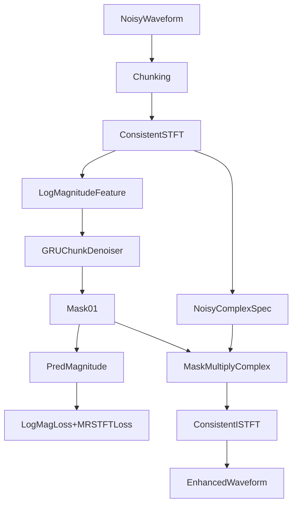

# STFT Tutarlilik ve Loss Iyilestirme Plani

## Hedef
Modelin egitim-cikarsim uyumsuzluklarini gidermek icin:
- analiz/sentez spektral hattini tek tipe indirmek,
- loss'u log-domain ile hizalamak,
- multi-resolution STFT loss eklemek.

## Kapsam ve Degisecek Dosyalar
- Cekirdek ses donusumleri: [d:/SoundMufflerRNN/model_development/audio_pipeline.py](d:/SoundMufflerRNN/model_development/audio_pipeline.py)
- Egitim loss ve epoch akisi: [d:/SoundMufflerRNN/model_development/training_loop.py](d:/SoundMufflerRNN/model_development/training_loop.py)
- Egitim konfig / hiperparametreler: [d:/SoundMufflerRNN/model_development/train.py](d:/SoundMufflerRNN/model_development/train.py)
- Veri hazirlama (log-domain baglanti noktasi): [d:/SoundMufflerRNN/model_development/training_data.py](d:/SoundMufflerRNN/model_development/training_data.py)
- Cikarsim/sentez yolu: [d:/SoundMufflerRNN/model_development/eval.py](d:/SoundMufflerRNN/model_development/eval.py)
- Tekli demo yolu: [d:/SoundMufflerRNN/model_development/demo_single_pair_forward.py](d:/SoundMufflerRNN/model_development/demo_single_pair_forward.py)
- Tekli eval yolu: [d:/SoundMufflerRNN/model_development/eval_one.py](d:/SoundMufflerRNN/model_development/eval_one.py)
- Dokumantasyon ve calistirma notlari: [d:/SoundMufflerRNN/model_development/README.md](d:/SoundMufflerRNN/model_development/README.md)

## Mimari Degisiklikler

## Adim 1 - Analiz/Sentez Tutarliligi (En kritik)
1. `audio_pipeline.py` icine tek bir "kaynak-otorite" donusum API'si ekle:
   - `analysis_stft_chunks(...)`
   - `synthesis_istft_chunks(...)`
   - Her iki fonksiyon da ayni `n_fft/win_length/hop/window/center` sozlesmesini kullansin.
2. `eval.py`, `demo_single_pair_forward.py`, `eval_one.py` icindeki su hatti kaldir:
   - `np.fft.rfft(...)` + `np.fft.irfft(...)`
   - Yerine yeni tutarli STFT/ISTFT fonksiyonlarini cagir.
3. Faz politikasi netlestir:
   - Varsayilan: noisy complex STFT fazi korunur, sadece magnitude maskelenir.
   - Bu davranis kodda tek yerde uygulanir; farkli scriptlerde kopya mantik kalmaz.

Esas degisim noktasi:
- [d:/SoundMufflerRNN/model_development/eval.py](d:/SoundMufflerRNN/model_development/eval.py) icindeki `_enhance_waveform`.

## Adim 2 - Loss Domain Hizalama (log-magnitude)
1. `training_loop.py` icinde loss hesaplamasini ayristir:
   - `linear_mag_mse` (opsiyonel, agirligi dusuk)
   - `log_mag_mse = MSE(log(pred_mag+eps), log(clean_mag+eps))` (ana terim)
2. Toplam loss kompozit olsun:
   - `total = w_log * log_mag_mse + w_lin * linear_mag_mse`
3. Egitim metrik kaydina ayri ayri loss bilesenlerini yaz:
   - `train_log_mag_mse`, `val_log_mag_mse`, `train_linear_mag_mse`, vb.

Esas degisim noktasi:
- [d:/SoundMufflerRNN/model_development/training_loop.py](d:/SoundMufflerRNN/model_development/training_loop.py)

## Adim 3 - Multi-Resolution STFT Loss
1. `training_loop.py` veya yeni yardimci modulde MR-STFT loss fonksiyonu ekle:
   - Birden fazla cozumurluk listesi: `(n_fft, win_length, hop_length)`
   - Her cozumurlukte en az:
     - spectral convergence
     - log-magnitude L1/L2
2. Bu loss dalga bicimi uzerinden hesaplanacagi icin:
   - `pred_mag + noisy_phase` ile `pred_complex`
   - Tutarli `ISTFT` ile `pred_wave`
   - `clean_wave` ile MR-STFT loss
3. Toplam objective genislet:
   - `total = w_log*w_logmag + w_mr*w_mrstft + w_lin*w_linear(optional)`

Not: Bu adim, Adim 1 tamamlanmadan uygulanmayacak.

## Adim 4 - Data ve Batch Arabirimi Tamamlama
1. `training_data.py` batch ciktisina gerekliyse waveform/chunk referansi ekle:
   - MR-STFT loss icin `clean_wave` veya reconstruct edilebilir temsil.
2. Padding/mask mantigini zaman-domain tarafta da tutarli hale getir:
   - valid region maskeleri (uzunluklar) hem mag hem waveform loss'ta uyumlu.

## Adim 5 - Konfig, Calisma Parametreleri ve Geriye Uyumluluk
1. `train.py` hiperparametrelerine yeni loss agirliklari ekle:
   - `w_log_mag`, `w_linear_mag`, `w_mrstft`
   - `mrstft_resolutions` listesi
   - `loss_log_eps`
2. Varsayilanlar minimal-risk olacak sekilde:
   - Once `w_mrstft` dusuk baslatilir.
   - `w_linear_mag` sifirlanabilir ya da cok kucuk tutulur.
3. Eski run config formati bozulmadan yeni alanlar eklenir.

## Adim 6 - Eval/Demo Tutarlilik ve Metrik Etkisi
1. `eval.py`, `eval_one.py`, `demo_single_pair_forward.py` ortak enhancement fonksiyonunu kullanir.
2. Degisiklik oncesi/sonrasi karsilastirma raporu:
   - SNR, SI-SDR, STOI, PESQ (varsa)
   - Ek olarak reconstruction sanity metric (enerji/clip oranlari)

## Adim 7 - Dokumantasyon ve Operasyonel Notlar
1. `README.md` guncelle:
   - yeni analiz/sentez hatti
   - loss formulasyonu
   - MR-STFT ayarlarini nasil degistirecegin
2. "Known trade-offs" bolumu ekle:
   - egitim maliyeti artisi
   - hangi agirliklarin hangi artefakti etkiledigi

## Uygulama Sirasi (Risk Minimizasyonu)
1. Analiz/sentez birlestirme
2. Log-domain loss aktivasyonu
3. MR-STFT loss ekleme
4. Hiperparametre tuning + raporlama

## Basari Kriterleri
- Kodda `rfft/irfft` yolu tamamen kaldirilmis olmali.
- Egitim loss raporunda log-loss bileseni gorunmeli.
- MR-STFT loss acildiginda train curve stabil kalmali (divergence yok).
- Eval metriklerinde baseline'a gore en az birincil metrikte anlamli iyilesme gorulmeli (PESQ/STOI/SI-SDR).