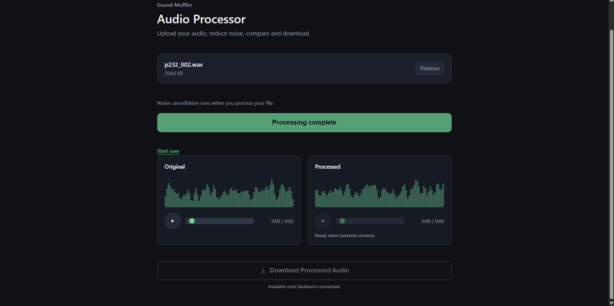
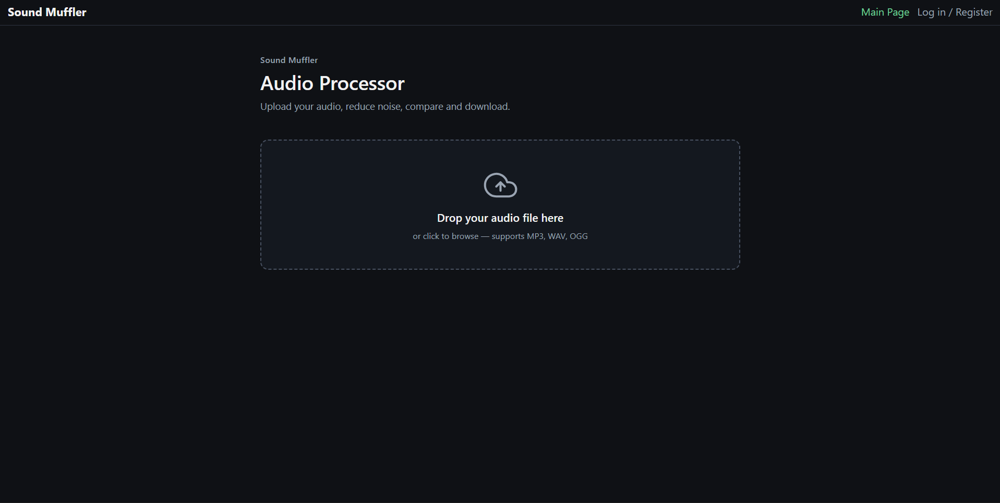
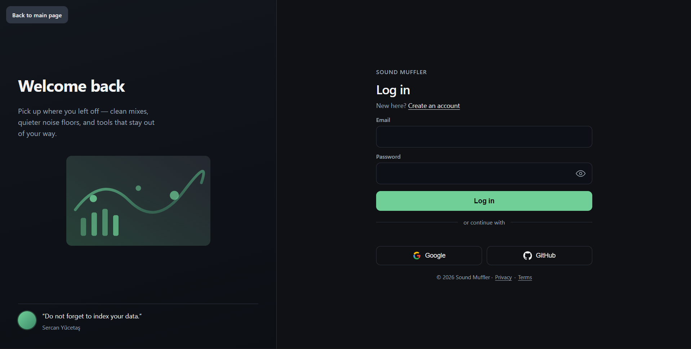
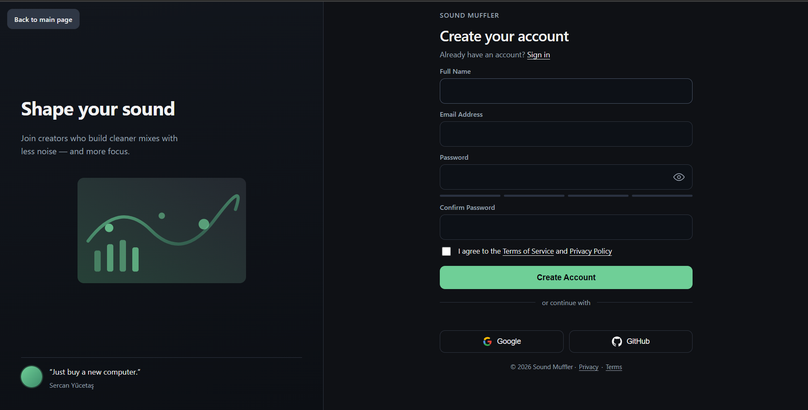
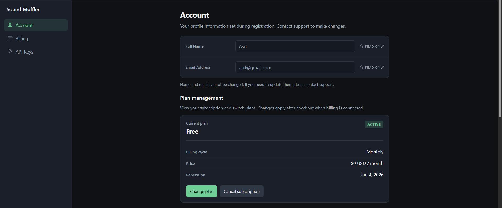
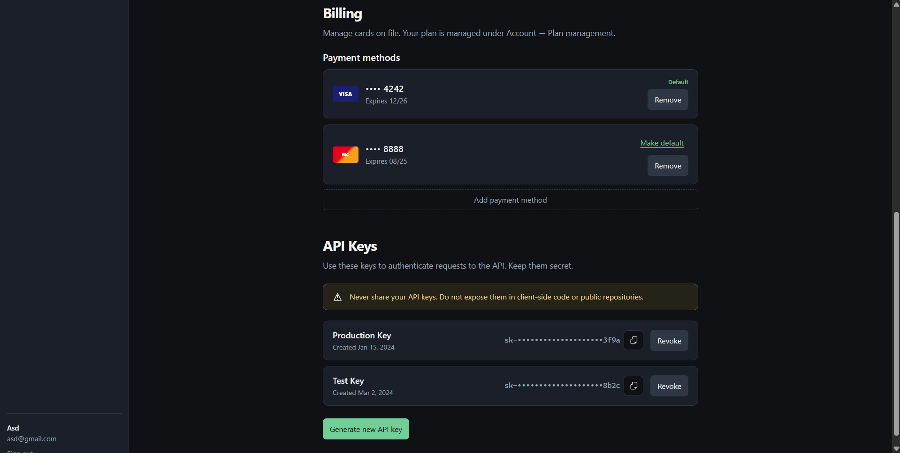

# SoundMufflerRNN Frontend

## Run Frontend

```bash
cd frontend/app
npm install
npm run dev
```

Open the local URL shown in terminal (usually `http://localhost:5173`).

## Screenshots







